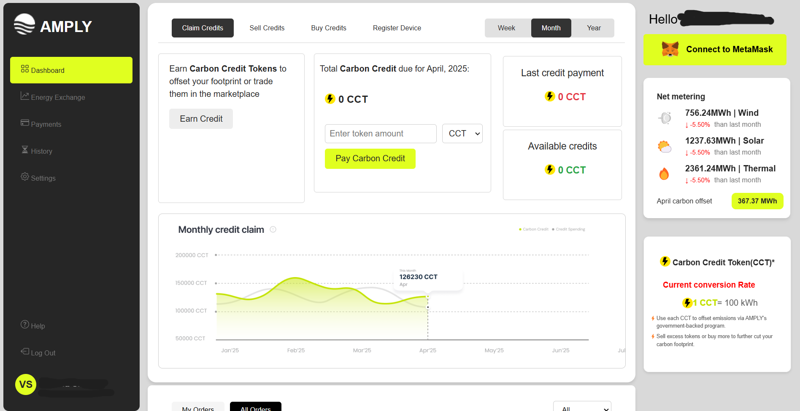
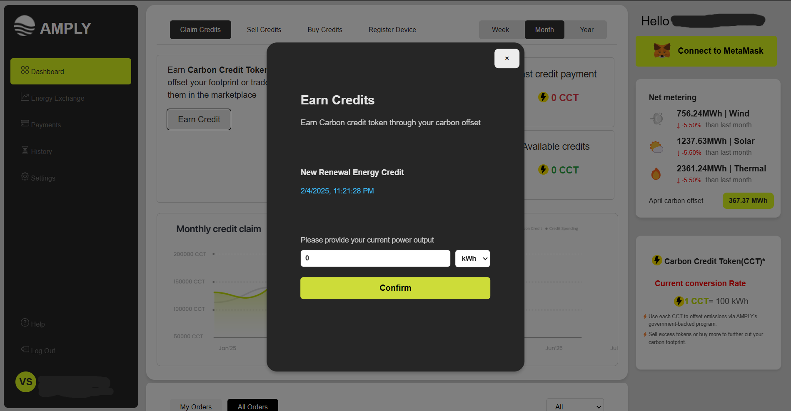
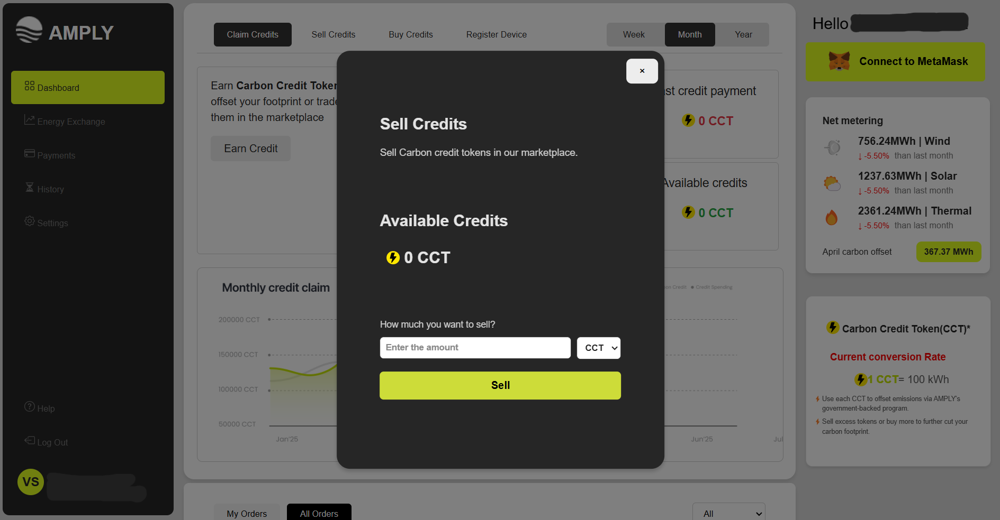

# AMPLY: A Blockchain-Based Carbon Credit Trading Platform

## Overview
Amply is a decentralized platform designed to tokenize carbon credits as ERC-20 tokens, ensuring transparency, security, and efficiency in carbon credit trading. Users can earn, buy, and sell carbon credits in an open market while leveraging blockchain technology for verification and trust.

### **Deployed Website**
The Amply platform is live and accessible via the following link:

🌍 [Visit AMPLY](https://yourdeployedwebsite.com)

---

### **Deployed Smart Contract Address**
The smart contract has been deployed on the **Ethereum Mainnet/Testnet**. You can interact with it using the following address:

```sh
Contract Address: 0xF94A195a8Ebb7B0ed48e8B506C785bB1F7bf4732
```

You can also verify the contract on **Sepolia-Etherscan**:
[View Contract on Sepolia-Etherscan](https://sepolia.etherscan.io/address/0xF94A195a8Ebb7B0ed48e8B506C785bB1F7bf4732)


## Features

### 1. **User Authentication & Wallet Integration**
- Users sign up and log in to access personalized features.
- **Metamask** integration enables seamless blockchain interactions.

### 2. **Earning Carbon Credits**
- Users claim carbon credits based on their renewable energy production.
- IoT devices and smart meters log production data on-chain for transparency.

### 3. **Decentralized Carbon Credit Trading**
- Tokenized carbon credits facilitate an open and trustless trading environment.
- Secure smart contract transactions ensure legitimacy.

### 4. **ZK-SNARKs Balance Verification**
💡 **Ensuring Privacy with Zero-Knowledge Proofs**
- Buyers can press the **Verify Balance** button to generate a Zero-Knowledge proof using **snark.js**.
- This proof confirms that the seller has enough balance to fulfill the order **without revealing their total holdings**.
- The proof is verified on-chain before allowing the trade to proceed.

### 5. **Buying & Selling Carbon Credits**
- **Sell Orders:** Users can list their available carbon credits for sale.
- **Buy Orders:** Buyers can either:
  - Select specific sell orders.
  - Place a buy order for a specific amount and let the system match them with the best available offers.

---

## Smart Meter & IoT Device Integration

One of the key aspects of Amply is the seamless integration of **smart meters and IoT devices** to ensure the authenticity of claimed renewable energy production. This process ensures transparency and prevents fraudulent claims of carbon credits.

### **Device Registration**
Only the Owner have the access to register a device on chain .To maintain integrity, only registered IoT smart meters can log energy production data. The backend provides an API to register devices on-chain:
```javascript
app.post('/registerDevice', async (req, res) => {
    try {
        const { deviceAddress } = req.body;

        if (!ethers.isAddress(deviceAddress)) {
            return res.status(400).json({ error: "Invalid device address" });
        }

        // Send transaction
        const tx = await OwnerContractInstance.registerDevice(deviceAddress);
        await tx.wait();

        res.json({ success: true, txHash: tx.hash, message: "Device registered successfully" });
    } catch (error) {
        console.error("Error registering device:", error);
        res.status(500).json({ error: "Failed to register device", details: error.message });
    }
});
```

### **Logging Smart Meter Data**
Once registered, the device can log energy production data on-chain. This ensures that only legitimate energy data is recorded:
```solidity
function logSmartMeterData(
    address producer,
    uint256 timestamp,
    uint256 energyProduced
) external returns (bool success){
    require(registeredDevices[msg.sender], "Device not registered");
    require(energyProduced > 0, "Energy produced must be greater than 0");
    require(smartMeterData[producer][timestamp] == 0, "Data already logged for this timestamp and Credits have been earned");

    smartMeterData[producer][timestamp] = energyProduced;
    
    emit SmartMeterDataLogged(producer, timestamp, energyProduced, msg.sender);
    return true;
}
```

### **Claiming Carbon Credits**
When a user attempts to earn carbon credits, the system ensures that their claim aligns with recorded smart meter data:
```solidity
function earnCarbonCredit(uint256 energyProduced, uint256 timestamp) external returns (uint256 creditsEarned){
    require(energyProduced > 0, "Energy produced must be greater than 0");

    uint256 recordedEnergy = smartMeterData[msg.sender][timestamp];
    require(recordedEnergy > 0, "No smart meter data for this timestamp");
    require(recordedEnergy >= energyProduced, "Claim exceeds recorded energy");

    uint256 creditsToMint = energyProduced * 1e18 / ENERGY_TO_CREDIT_CONVERSION;
    require(creditsToMint > 0, "Energy produced is insufficient for a single credit");

    smartMeterData[msg.sender][timestamp] -= energyProduced;
    _mint(msg.sender, creditsToMint);

    emit CarbonCreditsMinted(msg.sender, energyProduced, creditsToMint);
    return creditsToMint;
}
```

This mechanism guarantees that:
✅ Only **registered devices** can log energy data.
✅ **Fraudulent claims** are prevented by ensuring claimed energy does not exceed recorded production.
✅ Users **earn carbon credits** based on verified renewable energy production.

---

## Tech Stack
- **Frontend:** React, CSS
- **Backend:** Node.js, Express.js 
- **Blockchain:** Solidity, Ethereum (ERC-20 Tokens), ethers.js
- **Authentication:** Local Google, Metamask
- **Privacy Layer:** ZK-SNARKs (Zero-Knowledge Proofs)
- **Data Verification:** IoT devices and Smart Meters

---

## Installation & Setup

### Prerequisites
- Node.js and npm installed.
- Metamask wallet configured.
- Access to an Ethereum testnet (Sepolia) for smart contract interactions.

### Clone the Repository
```sh
   git clone https://github.com/Energy-ChainDevelopment/Kriti-BlockChain.git
   cd Kriti-BlockChain
```
### Environment Variables
Create a `.env` file in the backend folder with the following contents:
```sh 
MONGO_URI = "MongoDB URI to connect"
INFURA_PROJECT_ID = "Your Infura Project ID"
PRIVATE_KEY = "Your Ethereum Private Key"
ZK_PROOF_KEY = "ZK-SNARK Proof Key"
CLIENT_ID = "Your Google Client ID"
CLIENT_SECRET = "Your Google Client Secret"
CLIENT_URL = "Your Google Client URL"
SECURITY_TOKEN_MAIL_OTP = "Your Security Token"
SENDGRID_API_KEY = "Your SendGrid API Key"
TWILIO_ACCOUNT_SID = "Your Twilio Account SID"
TWILIO_AUTH_TOKEN = "Your Twilio Auth Token"
TWILIO_PHONE_NUMBER = "Your Twilio Phone Number"
CONTRACT_ADDRESS = "Your Smart Contract Address"
OWNER_PVT_KEY = "Your Owner Private Key"
DEVICE_PVT_KEY = "Your Device Private Key"
VERIFIER_CONTRACT_ADDRESS = "Your Verifier Contract Address"
GENERAL_ACCOUNT_PVT_KEY = "Your General Account Private Key"
```
---
### Frontend Environment Variables
Create a `.env` file in the frontend folder with the following contents:
```sh
VITE_REACT_APP_API_URL = "http://localhost:8080"
VITE_CONTRACT_ADDRESS =0xF94A195a8Ebb7B0ed48e8B506C785bB1F7bf4732
```
---


### Backend Setup
```sh
   cd backend
   npm install
   npm start
```

### Frontend Setup
```sh
   cd frontend
   npm install
   npm run dev
```

The application should now be running on `http://localhost:5173`.


## Web Application Snippets

1. **Dashboard**

   

3. **Carbon Credit Claim Page**

   

4. **Placing Sell Order**

   

5. **Placing Buy Order**

   

---


